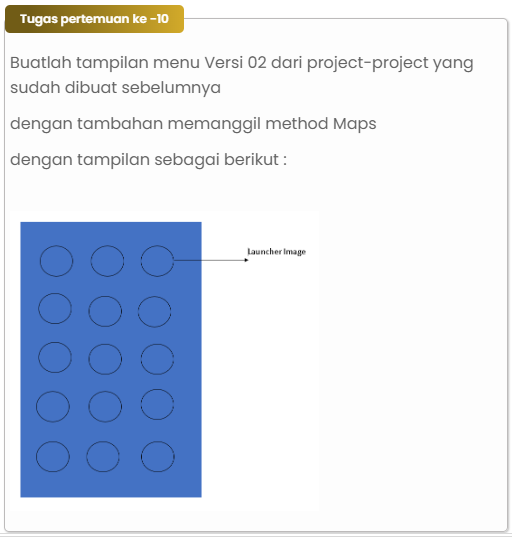

# Maul_Apps

|  |  |  |
|-----|------|-----|
|Nama|Muhammad Rizqi Maulana|
|NIM|312210360|
|Kelas|TI.22.A.4|
|Mata Kuliah|Pemograman Mobile|

## Explicit Intent

- **Activity Declarations**: Setiap aktivitas (activity) dalam aplikasi dideklarasikan dengan menggunakan elemen `<activity>`. Dalam hal ini, terdapat beberapa aktivitas seperti `Home`, `MainActivity1`, `OneActivity`, `SecondActivity`, `MainActivity`, `CountActivity`, `ScrollingIceCold`, dan `Splashscreen`. Penggunaan atribut `android:name` menunjukkan nama aktivitas.
- **Intent Filter pada Aktivitas `Splashscreen`**: Aktivitas `Splashscreen` memiliki intent filter yang mendefinisikan bahwa aktivitas ini adalah aktivitas utama `(MAIN)` dan harus dianggap sebagai launcher `(LAUNCHER)`. Ini adalah contoh penggunaan eksplisit untuk menentukan aktivitas awal yang akan diluncurkan ketika aplikasi dimulai.

## Implicit Intent

- **Intent Filter pada Aktivitas Home**: Aktivitas `Home` memiliki `intent filter` dengan beberapa aksi `(action)` dan kategori `(category)`. Ini menunjukkan penggunaan implisit, di mana aktivitas ini dapat merespons kepada beberapa jenis intent, seperti `android.intent.action.SET_ALARM` dan `android.intent action.VIEW`. Ini memungkinkan aplikasi merespons permintaan yang sesuai tanpa merinci komponen yang harus dijalankan.
- **Data pada Intent Filter Aktivitas Home**: Pada intent filter aktivitas `Home`, terdapat elemen `<data>` yang menunjukkan bahwa aktivitas ini dapat menangani skema `(scheme) "geo"`. Ini adalah contoh penggunaan implisit untuk menanggapi intent yang memiliki data dengan skema tertentu.

## Tugas

## Tampilan Project

